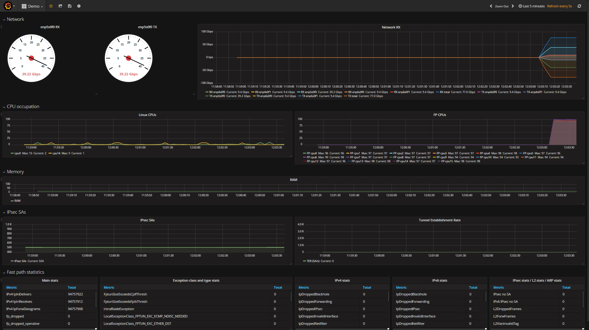
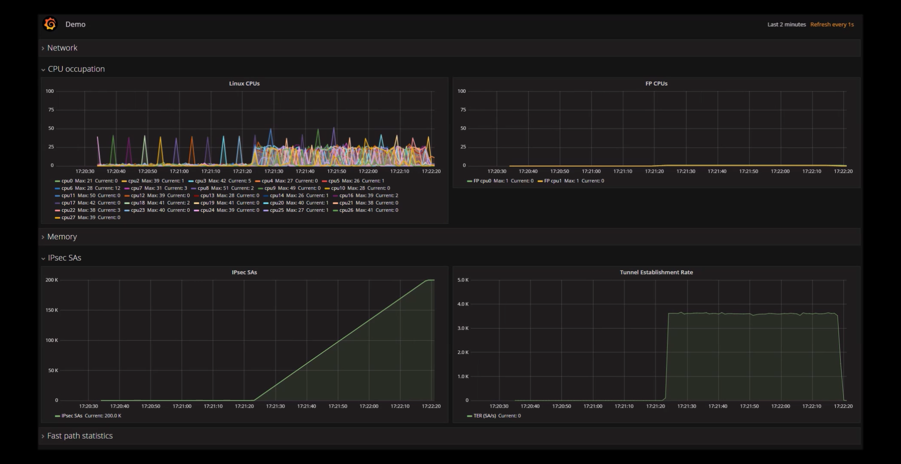
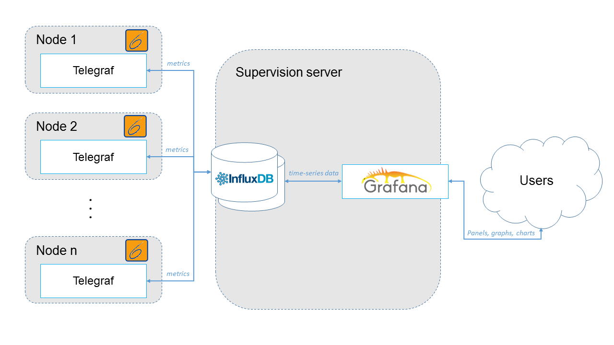
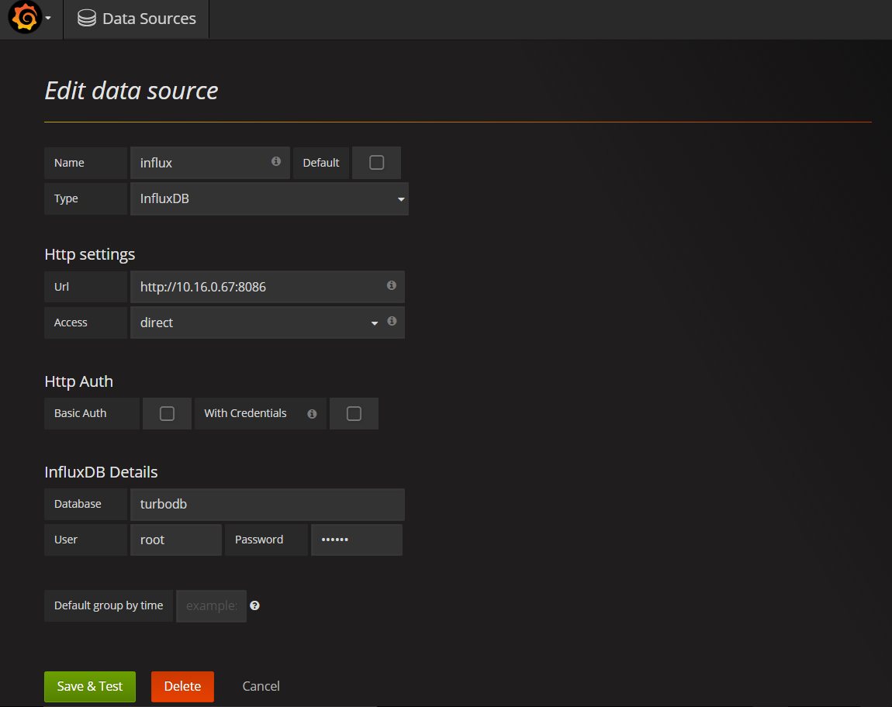

# Supervising 6WIND products with Grafana, InfluxDB and Telegraf

The following guide offers a way to supervise and monitor the activity
of your servers running a 6WIND product. Using only common open source
tools (Grafana, InfluxDB, Telegraf) and configuration files we provide,
you will be able to see many runtime information on a web based
graphical interface:





Thanks to the strong community around those tools, it will also be
simple to add your own metrics to monitor other functions.

See below the proposal supervision architecture:



This document was tested with Ubuntu 16.04 distribution with the
following software versions:

-   linux distribution: Linux ubuntu1604 4.4.0-47-generic \#68-Ubuntu
    SMP Wed Oct 26 19:39:52 UTC 2016 x86\_64 x86\_64 x86\_64 GNU/Linux
-   InfluxDB: 1.1.1
-   Grafana: 4.0.2
-   Telegraf: 1.1.1

InfluxDB
========

InfluxDB is an open source database written specifically to handle time
series data with high availability and high performance requirements.

Run the following command to install InfluxDB:

``` {.sourceCode .console}
# curl -sL https://repos.influxdata.com/influxdb.key | apt-key add -
# echo "deb https://repos.influxdata.com/ubuntu xenial stable" | tee \
  /etc/apt/sources.list.d/influxdb.list
# apt-get update && apt-get install influxdb

# systemctl enable influxdb
# systemctl start influxdb
```

> **note**
>
> Make sure to install the package located in the influxdata repository.
> ``` {.sourceCode .console}
> # apt-cache policy influxdb
> ```
>
> Check the [InfluxDB official
> documentation](https://docs.influxdata.com/influxdb/v1.1/introduction/installation/).

Run the following commands to create a database:

``` {.sourceCode .console}
# influx -execute 'create database turbodb'
# influx -execute 'show databases'
name: databases
name
----
turbodb
_internal
```

Grafana
=======

Grafana is an open source metric analytics and visualization suite. It
is most commonly used for visualizing time series data for
infrastructure and application analytics.

Installation
------------

``` {.sourceCode .console}
# curl https://packagecloud.io/gpg.key | apt-key add -
# echo "deb https://packagecloud.io/grafana/stable/debian/ jessie main" | \
  tee /etc/apt/sources.list.d/grafana.list
# apt-get update && apt-get install grafana

# systemctl enable grafana-server
# systemctl start grafana-server
```

> **note**
>
> Check the [Grafana official
> documentation](http://docs.grafana.org/installation/debian/).

Gauge plugin installation
-------------------------

Check the plugin webpage
[here](https://grafana.net/plugins/briangann-gauge-panel).

``` {.sourceCode .console}
# grafana-cli plugins install briangann-gauge-panel
installing briangann-gauge-panel @ 0.0.2
from url: https://grafana.net/api/plugins/briangann-gauge-panel/versions/0.0.2/download
into: /var/lib/grafana/plugins

+ Installed briangann-gauge-panel successfully

Restart grafana after installing plugins . <service grafana-server restart>

# systemctl restart grafana-server
```

Data source and panel configuration
-----------------------------------

Add and configure a new data source as described in the following
screenshot. Just update the IP address with your supervision server IP
address, and the database name and credentials if you have changed them.



Dashboard import
----------------

Now, download our preconfigured [dashboard](6WIND_dashboard.json) and import it
in your grafana.

This dashboard contains six rows:

-   Speedometers: display an instant throughput performance on an interface
-   Network: display an history of the throughput performance, on both TX and
    RX sides, for all interfaces and a total wave
-   CPU occupation: display the linux and fast path CPU occupation. Just
    choose which CPU is used by linux or the fast path by hidding it or not in
    the edit metrics menu of each graph
-   Memory: display the used RAM in percents
-   IPsec SAs: show the number of SA and the creation rate in the linux kernel
-   Fast path statistics: show all fast path statistics, exceptions,

Telegraf
========

Telegraf has to be installed on each server running a 6WIND product. It
will transmit data to the InfluxDB server.

Use the following commands to download and install the Telegraf agent:

``` {.sourceCode .console}
# curl -sL https://repos.influxdata.com/influxdb.key | apt-key add -
# echo "deb https://repos.influxdata.com/ubuntu xenial stable" | \
  tee /etc/apt/sources.list.d/influxdb.list
# apt-get update && apt-get install telegraf
```

> **note**
>
> Check the [Telegraf official
> documentation](https://docs.influxdata.com/telegraf/v1.1/introduction/installation/).

Then, configure the Telegraf agent in the configuration file located in
/etc/telegraf/telegraf.conf.

See an example of configuration file: [telegraf.conf](telegraf.conf).

> **warning**
>
> Some commands used to get the metrics need root access to be executed.
> Edit the systemd service file and comment the User line to be able to
> run fast path commands:
>
> ``` {.sourceCode .console}
> # systemctl edit --full telegraf.service
> ```

Now, start the Telegraf agent:

``` {.sourceCode .console}
# systemctl enable telegraf
# systemctl start telegraf
```

> **note**
>
> You can test your configuration file using the following:
>
> ``` {.sourceCode .console}
> # telegraf -config /etc/telegraf/telegraf.conf -test
> ```
